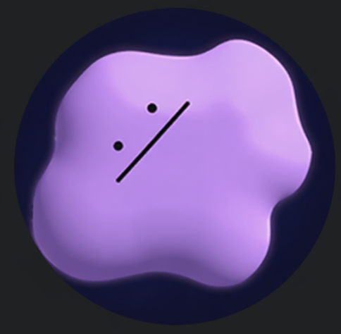
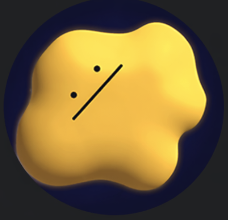
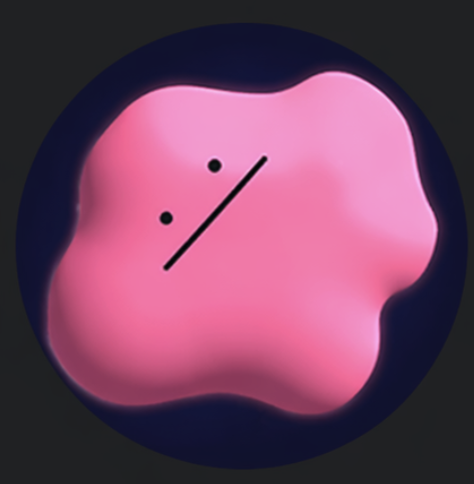
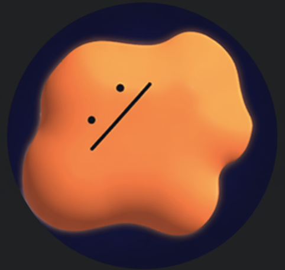

<h1 align="center">🔍 PILL SIGHT 알약 탐지 프로그램</h1>

<p align="center">
  <b>  ▎ YOLO 기반 실시간 알약 탐지 및 분류 시스템       
  카메라 또는 이미지 입력으로 알약의 종류와 위치를
  자동으로 감지하고, 실험별 성능 지표를          
  체계적으로 추적·비교합니다. </b>
</p>

<p align="center">
  
  
  
</p>

---

## 👥 팀원 구성

<table align="center">
  <tr>
    <td align="center" width="150">
      <br/>
      <b>Adam</b><br/>
      <a href="https://github.com/Adam-1228">@Adam</a>
    </td>
    <td align="center" width="150">
      <br/>
      <b>Eastar0102</b><br/>
      <a href="https://github.com/Eastar0102">@Eastar0102</a>
    </td>
    <td align="center" width="150">
      <br/>
      <b>heewon02</b><br/>
      <a href="https://github.com/heewon02">@heewon02</a>
    </td>
    <td align="center" width="150">
      <br/>
      <b>minjaejeon</b><br/>
      <a href="https://github.com/minjaejeon0827">@minjaejeon</a>
    </td>
    <td align="center" width="150">
      <br/>
      <b>기하</b><br/>
      <a href="https://github.com/wenttoofar">@기하</a>
    </td>
    <td align="center" width="150">
      <br/>
      <b>무심</b><br/>
      <a href="https://github.com/wjdtmdgh87-lgtm">@무심</a>
    </td>
  </tr>
</table>

---

## 🛠 기술 스택

<p align="center">
  
  
  
  
  
  
</p>

---
### 발표 자료


[📄 프로젝트 보고서](./docs/profiles/6팀_보고서.pdf)

[📊 발표 자료](./docs/profiles/6팀_발표.pptx)

---

## 협업일지

## 협업일지

| 이름 | 링크 |
|------|------|
| 성치용 | [협업일지][치용] |
| 정승호 | [협업일지][승호] |
| 전민재 | [협업일지][민재] |
| 임동규 | [협업일지][동규] |
| 송기하 | [협업일지][기하] |
| 조희원 | [협업일지][희원] |

[치용]: https://broken-a-lot-of-bone.tistory.com/category/%EC%B4%88%EA%B8%89%ED%94%84%EB%A1%9C%EC%A0%9D%ED%8A%B8_%EA%B2%BD%EA%B5%AC%EC%95%BD%EC%B2%B4_%ED%83%90%EC%A7%80
[승호]: https://www.notion.so/348835bcc7588014bdb7d345644b534b?source=copy_link
[민재]: https://www.notion.so/AI-_10-_-2_6-_AI-_-2026_04-05-34857454ec1d80d690c9d09c8165806f?source=copy_link
[동규]: https://www.notion.so/6-_-_-34850973847880a49959d7639bbfec66?source=copy_link
[기하]: https://broken-a-lot-of-bone.tistory.com/category/%EC%B4%88%EA%B8%89%ED%94%84%EB%A1%9C%EC%A0%9D%ED%8A%B8_%EA%B2%BD%EA%B5%AC%EC%95%BD%EC%B2%B4_%ED%83%90%EC%A7%80

## 📁 프로젝트 구조

```
📦 project-root
├── 📂 src/
│   ├── config.py              # 경로 및 하이퍼파라미터 설정
│   ├── dataset.py             # 데이터 경로 수정 및 통계 출력
│   ├── model.py               # 학습 및 예측
│   ├── ocr_correction.py      # OCR 기반 각인 보정
│   ├── wbf_ensemble.py        # 5-Fold WBF 앙상블
│   ├── experiment.py          # 실험 관리
│   ├── prepare_data.py        # 데이터 전처리
│   ├── 📂 eval/               # 평가 모듈
│   │   ├── metrics.py         # YOLO 메트릭 정규화
│   │   ├── visualize.py       # 결과 시각화
│   │   ├── compare_yolo_runs.py  # 실험 비교
│   │   └── report_template.py    # 리포트 생성
│   └── 📂 utils/              # 유틸리티
│       ├── common.py
│       └── io_utils.py
├── 📂 config/
│   └── settings.py            # 전역 설정
├── 📂 data/
│   ├── images/train/          # 학습 이미지
│   ├── images/test/           # 테스트 이미지
│   ├── labels/train/          # YOLO 형식 라벨
│   └── splits/                # fold별 train/val txt
├── 📂 models/                 # 학습 완료된 가중치
├── 📂 results/                # 학습 결과 (csv, confusion matrix 등)
├── 📂 outputs/
│   └── yolo/                  # YOLO 출력 결과
├── 📂 docs/
│   └── profiles/              # 팀원 프로필
├── data.yaml                  # YOLO 데이터셋 설정
├── code_mapping.csv           # 코드-약품명 매핑
└── main.py
```

---

## 🚀 시작하기

### 설치

```bash
git clone https://github.com/wjdtmdgh87-lgtm/codeit-.git
cd codeit-
pip install -r requirements.txt
```

GPU(CUDA) 환경:

```bash
pip install -r requirements-cuda.txt
```

---

## 실행 방법

데이터 폴더에 이미지(`train`, `test`)와 라벨 파일(`.txt`)을 넣은 후 프로젝트 루트에서 실행합니다.

```bash
python main.py --mode [모드] [옵션]
```

---

## 실행 모드

### `--mode data`
데이터팀이 제공한 split txt 파일의 경로를 수정하고 통계를 출력합니다.

```bash
python main.py --mode data
```

### `--mode train`
`data.yaml` 기준으로 fold 1 단일 학습을 실행합니다.  
학습 완료 후 `models/baseline_{모델명}_best.pt`에 저장됩니다.

```bash
python main.py --mode train
```

### `--mode train_all`
fold 1~5를 순서대로 자동 학습합니다.  
각 fold 결과는 `models/fold{N}_{모델명}_best.pt`에 저장됩니다.  
WBF 앙상블 사용 시 이 모드로 먼저 학습해야 합니다.

```bash
python main.py --mode train_all
```

### `--mode predict`
단일 모델로 이미지를 예측합니다.  
결과는 `runs/detect/predict_{모델명}/`에 저장됩니다.

```bash
python main.py --mode predict --source data/images/test/

# 가중치 직접 지정
python main.py --mode predict --source data/images/test/ --weights models/best_model.pt

# 신뢰도 임계값 조정
python main.py --mode predict --source data/images/test/ --conf 0.5
```

### `--mode wbf`
5-Fold WBF(Weighted Boxes Fusion) 앙상블 예측을 실행합니다.  
`models/` 폴더의 `fold*_best.pt` 파일을 자동으로 수집합니다.  
결과는 `runs/detect/wbf_{모델명}/`에 저장됩니다.

```bash
python main.py --mode wbf --source data/images/test/

# 신뢰도 임계값 조정
python main.py --mode wbf --source data/images/test/ --conf 0.15
```

### `--mode experiment`
실험 이름별로 학습을 실행합니다.

```bash
python main.py --mode experiment --exp baseline
```

### `--mode experiment_all`
`config/experiments/` 의 모든 실험을 순차 실행합니다.

```bash
python main.py --mode experiment_all
```

### `--mode compare`
누적된 실험 결과를 비교합니다.

```bash
python main.py --mode compare
```

### `--mode all`
데이터 준비(`data`) → 학습(`train`)을 순서대로 실행합니다.

```bash
python main.py --mode all
```

---

## 옵션

| 옵션 | 설명 | 기본값 |
|------|------|--------|
| `--mode` | 실행 모드 | `all` |
| `--source` | 예측 이미지 경로 또는 폴더 | `None` |
| `--weights` | 예측 시 사용할 가중치 경로 | `models/best_model.pt` |
| `--conf` | 신뢰도 임계값 | `0.25` |
| `--exp` | experiment 모드 실험 이름 | `baseline` |
| `--no-ocr` | OCR 각인 보정 비활성화 | `False` |

---

## 📊 주요 기능

| 기능 | 설명 |
|------|------|
| **메트릭 정규화** | mAP50, mAP50-95, Precision, Recall 등 YOLO 지표 표준화 |
| **실험 비교** | 여러 YOLO 실험 결과를 나란히 비교 |
| **시각화** | 학습 곡선 및 성능 지표 시각화 |
| **리포트 생성** | 실험 결과 자동 리포트 생성 |
| **OCR 보정** | 각인 기반 클래스 보정 |
| **WBF 앙상블** | 5-Fold Weighted Boxes Fusion 앙상블 |

---

## 결과 저장 위치

```
models/
├── baseline_{모델명}_best.pt    # train 모드 결과
├── fold1_{모델명}_best.pt       # train_all 모드 결과
├── fold2_{모델명}_best.pt
└── ...

runs/detect/
├── predict_{모델명}/            # predict 모드 결과
└── wbf_{모델명}/                # wbf 모드 결과

results/
└── {실험명}/
    ├── weights/best.pt
    ├── results.csv
    └── confusion_matrix.png
```

---

<p align="center">
  Made with ❤️ HAPPY 6 TEAM
</p>
